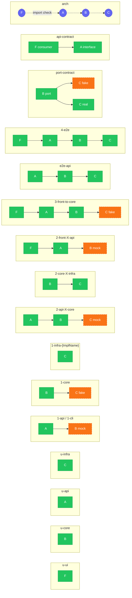

# Test Mapping — Hexagonal Architecture

## Modules

| Symbol | Name | Cardinality |
|--------|------|-------------|
| **F** | Frontend | 1 |
| **A** | Entry adapter (API, CLI, connector) | 1 per entry point |
| **B** | Application + Core (domain + use cases) | 1 only |
| **C** | Infra adapters (implement outbound ports) | N ports × M implementations |

---

## Test Map

### Level 0 — Unit tests (1 module, internal code)

#### 0a. Unit — Core (B)

| | |
|---|---|
| **Scope** | B internals (entities, value objects, domain services) |
| **Name** | `u-core` |
| **Suggested names** | `unit-core`, `domain-unit`, `core-unit`, `biz-unit` |
| **Description** | Tests business rules, edge cases, and computations at the method level. No technical dependencies. Mostly pure functions. |
| **Pros** | Ultra-fast, deterministic, suitable for property-based testing, immediate feedback |
| **Cons** | Does not validate interactions between components |
| **Burden** | 5 — pure functions, no setup, no dependencies to mock |
| **Value** | 85 — directly validates business rules; highest signal per line of code |
| **ROI** | 17.00 — best ratio in the table: near-zero cost, near-maximum signal |
| **Volume** | 80 — should be the bulk of the suite; one test per rule, edge case, or invariant |
| **When to use** | Every time domain logic, entity, value object, or business rule is added or changed. One test per rule or edge case. |

#### 0b. Unit — Frontend (F)

| | |
|---|---|
| **Scope** | F internals (components, hooks, utils) |
| **Name** | `u-ui` |
| **Suggested names** | `unit-ui`, `ui-unit`, `front-unit`, `component-unit` |
| **Description** | Tests the internal logic of React components, hooks, and utility functions. |
| **Pros** | Fast, isolates rendering and UI logic bugs |
| **Cons** | Does not validate integration with the real API |
| **Burden** | 12 — testing-library/JSDOM setup, mild rendering overhead |
| **Value** | 60 — good signal on UI logic but limited scope; no API or state integration |
| **ROI** | 5.00 — strong ratio but lower than u-core due to setup overhead |
| **Volume** | 20 — cover all hooks and non-trivial component logic; skip pure presentational |
| **When to use** | When a component or hook has non-trivial internal logic independent of the API. Skip for pure presentational components. |

#### 0c. Unit — API internals (A)

| | |
|---|---|
| **Scope** | A internals (middleware, helpers, utils) — no B, no C |
| **Name** | `u-api` |
| **Suggested names** | `unit-api`, `api-unit`, `middleware-unit` |
| **Description** | Tests individual middleware or utility functions in the entry adapter in full isolation. No use-case mock needed; B is simply absent. |
| **Pros** | Ultra-fast, deterministic, zero setup beyond faking req/res |
| **Cons** | Does not validate routing or the HTTP contract end-to-end |
| **Burden** | 5 — fake req/res/next objects, no framework to spin up |
| **Value** | 60 — validates transport guards and error shaping; lower signal than u-core |
| **ROI** | 12.00 — near-zero cost for meaningful coverage of cross-cutting transport logic |
| **Volume** | 10 — one test per middleware or pure adapter utility; skip thin pass-throughs |
| **When to use** | When adding or modifying a middleware (auth, error handling, logging) or a stateless adapter utility. Do not use for route handlers — those belong to `1-api`. |

#### 0d. Unit — Infra internals (C)

| | |
|---|---|
| **Scope** | C internals (parsers, pure transformers) — no external I/O |
| **Name** | `u-infra` |
| **Suggested names** | `unit-infra`, `infra-unit`, `parser-unit` |
| **Description** | Tests pure transformation logic inside an infra adapter (e.g. file parsers, data mappers) without hitting any external system. |
| **Pros** | Ultra-fast, no infrastructure required, immediate feedback |
| **Cons** | Does not validate the adapter's integration with the real external system |
| **Burden** | 8 — may need in-memory fixtures (buffers, sample data); no containers |
| **Value** | 65 — validates parsing and mapping correctness; complements `1-infra-*` |
| **ROI** | 8.13 — very cheap given the absence of I/O; worthwhile whenever adapter logic is non-trivial |
| **Volume** | 20 — one test per parser method or non-trivial mapping; skip adapters that are pure delegation |
| **When to use** | When an infra adapter contains pure transformation logic (parsing, mapping, encoding) that can be exercised with in-memory data. Do not use when the adapter's core value is the external call itself — use `1-infra-*` instead. |

---

### Level 1 — Module tests (1 module, via its interface)

#### 1a. Module — Entry adapter (A)

| | |
|---|---|
| **Scope** | Full A, B mocked |
| **Name** | `1-api`, `1-cli` |
| **Suggested names** | `adapter-in`, `api-module`, `entry-module`, `transport-test` |
| **Description** | Tests JSON serialization, DTO validation, HTTP status codes (200/400/404/500), and routing. B is simulated via mock/stub. |
| **Pros** | Verifies the HTTP contract without business logic, fast |
| **Cons** | Does not validate real business rules |
| **Burden** | 22 — B mock to maintain; HTTP test client setup |
| **Value** | 70 — validates the full HTTP contract (routing, status codes, serialization) |
| **ROI** | 3.18 — solid return; cheap to write, covers a well-defined surface |
| **Volume** | 40 (api) / 30 (cli) — one test file per adapter; cover all routes and error cases |
| **When to use** | When validating HTTP/CLI contract (status codes, serialization, validation) independently of business logic. One test file per entry adapter. |

#### 1b. Module — Core with test doubles (B)

| | |
|---|---|
| **Scope** | Full B via its interfaces, C replaced by in-memory fakes |
| **Name** | `1-core` |
| **Suggested names** | `core-module`, `app-module`, `use-case`, `biz-module` |
| **Description** | Instantiates the full core and injects in-memory fakes in place of infra adapters. Validates 100% of the business workflow. Ideal for BDD/Cucumber. |
| **Pros** | Ultra-fast, covers the entire domain, no database required |
| **Cons** | Fakes may diverge from the real implementation |
| **Burden** | 30 — C fakes must be created and kept in sync with real adapters |
| **Value** | 90 — highest value; covers 100% of business workflows without infra |
| **ROI** | 3.00 — excellent ratio despite fake maintenance cost |
| **Volume** | 85 — BDD primary vehicle; one test per use case scenario or acceptance criterion |
| **When to use** | When implementing or modifying a use case. Primary vehicle for BDD scenarios. One test per business scenario or acceptance criterion. |

#### 1c. Module — Outbound adapter / Infra (C)

| | |
|---|---|
| **Scope** | Each C adapter individually, real external systems |
| **Name** | `1-infra-{ImplName}` |
| **Suggested names** | `infra-module`, `adapter-out`, `repo-test`, `driven-adapter` |
| **Description** | Tests SQL queries, third-party HTTP client configuration, and entity↔DB mapping. Uses ephemeral containers (Testcontainers). Compares implementations of the same port to validate interchangeability. |
| **Pros** | Real confidence on the data layer, validates SQL syntax |
| **Cons** | Slow, costly (containers), hard to parallelize |
| **Burden** | 60 — Testcontainers setup, DB migrations, slow execution, hard to parallelize |
| **Value** | 75 — high confidence on SQL correctness and data mapping |
| **ROI** | 1.25 — low ratio; infra cost dominates; only write for non-trivial queries |
| **Volume** | 55 — one suite per adapter; cover each method and edge cases (nulls, pagination) |
| **When to use** | When writing or modifying a repository, SQL query, or third-party client. One suite per adapter implementation. Run against a real DB via Testcontainers. Runs only on demand not at each commit in CI |

---

### Level 2 — Integration tests (2 modules)

#### 2a. Adapter + Core (A + B)

| | |
|---|---|
| **Scope** | A + B, C mocked |
| **Name** | `2-api-X-core` |
| **Suggested names** | `int-api-core`, `entry-core`, `api-biz`, `adapter-core` |
| **Description** | Tests the integration between the entry point and the core. Infra ports are mocked. Verifies that routing, validation, and use cases chain correctly. |
| **Pros** | Covers two layers without a database, still fairly fast |
| **Cons** | C mocks may hide real incompatibilities |
| **Burden** | 38 — two modules to wire; C mock may drift from real behavior |
| **Value** | 55 — limited by C mock; cannot validate real persistence behavior |
| **ROI** | 1.45 — marginal; prefer combining 1-api + 1-core unless wiring bugs are recurring |
| **Volume** | 0 — skip unless wiring bugs are a recurring problem; prefer 1-api + 1-core separately |
| **When to use** | When verifying that a route correctly wires to the right use case, without needing a real database. Covers routing + validation + use-case dispatch. |

#### 2b. Core + Infra (B + C)

| | |
|---|---|
| **Scope** | B + C, no mock |
| **Name** | `2-core-X-infra` |
| **Suggested names** | `int-core-infra`, `core-infra`, `biz-db`, `app-infra` |
| **Description** | Tests the core with real infra implementations (real database). Validates that use cases work end-to-end on the backend side. |
| **Pros** | High confidence on logic + persistence |
| **Cons** | Slow, requires a database, exclude from CI by default |
| **Burden** | 65 — real DB required; slow; must manage migrations and test data |
| **Value** | 80 — validates the full backend loop without a transport layer |
| **ROI** | 1.23 — low ratio due to infra cost; justify with complex or critical persistence logic |
| **Volume** | 0 — skip unless persistence logic is critical and not covered by 1-infra alone |
| **When to use** | When validating that a use case works correctly with the real DB schema. Run after schema migrations or when repository logic changes. |

#### 2c. Frontend + Adapter (F + A, B mocked)

| | |
|---|---|
| **Scope** | F + A, B mocked |
| **Name** | `2-front-X-api` |
| **Suggested names** | `int-front-api`, `ui-api`, `front-adapter`, `front-transport` |
| **Description** | Tests the integration between the frontend and the API (serialization, HTTP error handling, navigation). The core application is simulated. |
| **Pros** | Isolates front↔API contract issues |
| **Cons** | Does not validate business logic |
| **Burden** | 50 — needs a running API mock server + frontend test environment |
| **Value** | 55 — validates transport concerns only; B mock limits business signal |
| **ROI** | 1.10 — near break-even; use only when front↔API contract is a recurring failure point |
| **Volume** | 0 — skip unless front↔API contract bugs are a recurring issue; prefer api-contract |
| **When to use** | When validating that the frontend correctly handles API responses, errors, and edge cases. Focus on transport-layer concerns (serialization, HTTP codes, loading states). |

---

### Level 3 — Integration tests (3 modules)

#### 3a. Frontend + Adapter + Core (F + A + B, C mocked)

| | |
|---|---|
| **Scope** | F + A + B, C replaced by fakes |
| **Name** | `3-front-to-core` |
| **Suggested names** | `int-front-core`, `ui-biz`, `front-app`, `e2e-no-db` |
| **Description** | Tests the complete workflow from the user interface down to use cases, without a real database. Enables validation of functional scenarios in isolation. |
| **Pros** | Covers the full user experience without infrastructure cost |
| **Cons** | C fakes may diverge from reality |
| **Burden** | 65 — complex setup: browser + full app wiring + C fakes |
| **Value** | 65 — good user journey coverage but C fake drift limits real-world confidence |
| **ROI** | 1.00 — break-even; only justified for critical flows not covered elsewhere |
| **Volume** | 0 — skip; prefer 1-core for business logic and e2e-api for backend coverage |
| **When to use** | When validating a complete user journey without infrastructure cost. Limit to critical functional scenarios. Prefer `1-core` for business logic coverage. |

#### 3b. Adapter + Core + Infra (A + B + C, no mock)

| | |
|---|---|
| **Scope** | A + B + C, no mock |
| **Name** | `e2e-api` |
| **Suggested names** | `int-api-full`, `backend-e2e`, `full-backend`, `api-infra`, `3-api-to-infra` |
| **Description** | Tests the full backend integration (REST → use case → database). Validates critical paths without a UI. |
| **Pros** | Maximum confidence on the backend side |
| **Cons** | Slow, requires full infrastructure |
| **Burden** | 70 — full backend infrastructure; slow; fragile against DB state |
| **Value** | 80 — validates the complete backend chain; highest backend confidence without UI |
| **ROI** | 1.14 — low ratio; justified only for critical paths before a release |
| **Volume** | 40 — one per critical backend flow; covers what 1-core + 1-infra cannot together |
| **When to use** | When validating critical backend paths end-to-end before a release or after major backend changes. Covers the full REST → use case → DB chain. |

---

### Level 4 — E2E tests (4 modules)

#### 4a. Full End-to-End (F + A + B + C)

| | |
|---|---|
| **Scope** | F + A + B + C, no mock |
| **Name** | `4-e2e` |
| **Suggested names** | `e2e`, `ui-e2e`, `system`, `full-e2e` |
| **Description** | Starts the entire application (ideally in a container), sends real UI interactions (Playwright, Cypress), and lets the application interact with a real test database. Limited to critical happy paths. |
| **Pros** | Maximum confidence, validates the system as the user experiences it |
| **Cons** | Very slow, brittle, costly to maintain, exclude from standard CI |
| **Burden** | 92 — full stack infra + Playwright/Cypress + flakiness management + slow CI |
| **Value** | 95 — maximum confidence; the system as the user truly experiences it |
| **ROI** | 1.03 — nearly break-even; only justified for the 2–5 most critical happy paths |
| **Volume** | 20 — limit to 2–5 scenarios; each must be irreplaceable by a cheaper test |
| **When to use** | For critical happy paths only (2–5 scenarios max). Smoke test after deployment. Never use to cover business logic — delegate that to `1-core`. |

---

### Complementary — Contract tests

#### C1. Internal contract (infra port)

| | |
|---|---|
| **Scope** | Port interface (B↔C) |
| **Name** | `port-contract` |
| **Suggested names** | `port-contract`, `infra-contract`, `port-parity`, `impl-parity` |
| **Description** | Test suite written against the port interface, run against each implementation (in-memory fake + real adapters). Guarantees all implementations are interchangeable. |
| **Pros** | Validates adapter interchangeability, detects fake/real divergence |
| **Cons** | Initial writing effort, requires discipline to keep the suite abstract |
| **Burden** | 42 — abstract suite to write and maintain; must run against both fake and real |
| **Value** | 85 — guarantees interchangeability; prevents silent fake/real divergence |
| **ROI** | 2.02 — good ratio; the suite is written once and reused across all implementations |
| **Volume** | 35 — one suite per port; cover all methods including edge cases (empty, error) |
| **When to use** | When adding a new adapter implementation or modifying a port interface. Write the suite once against the port; run it against every implementation including the in-memory fake. |

#### C2. External contract (API)

| | |
|---|---|
| **Scope** | A's interface as seen by F or a third-party service |
| **Name** | `api-contract` |
| **Suggested names** | `api-contract`, `consumer-contract`, `pact-test`, `api-compat` |
| **Description** | Verifies that API changes do not break consumers (frontend or microservices). Tooling: Pact. |
| **Pros** | Detects breaking changes before production |
| **Cons** | Requires cross-team coordination, additional tooling (Pact broker) |
| **Burden** | 58 — Pact broker setup, consumer-side generation, cross-team coordination |
| **Value** | 80 — detects breaking changes before they reach consumers in production |
| **ROI** | 1.38 — moderate ratio; high setup cost but critical for multi-consumer APIs |
| **Volume** | 5 — cover only the consumer-facing endpoints most likely to break |
| **When to use** | When the API has multiple consumers or before introducing breaking API changes. Requires a Pact broker and consumer-side test generation. |

#### C4. Retrieval quality

| | |
|---|---|
| **Scope** | B (real use cases) + partial C (real embedding adapter when API key available; in-memory repositories) |
| **Name** | `retrieval-quality` |
| **Suggested names** | `retrieval-quality`, `rag-quality`, `semantic-quality` |
| **Description** | Validates retrieval accuracy — that the right chunks surface for realistic queries — using the real embedding model. Repositories stay in-memory to keep the test fast. Tests are skipped when the API key is absent. |
| **Pros** | Catches embedding / chunking regressions that functional tests miss; no database required |
| **Cons** | Requires an external API key; non-deterministic if the embedding model changes; slow per test |
| **Burden** | 30 — no container, but external API key required; test data files must be committed |
| **Value** | 70 — validates real retrieval quality; complements `1-core` which only tests logic |
| **ROI** | 2.33 — good ratio for the coverage it provides; one suite per document/domain |
| **Volume** | 5 — one suite per key document or domain; cover the critical retrieval scenarios |
| **When to use** | When changing chunking strategy, embedding model, or retrieval parameters. Place in `tests/retrieval/`. Skip in CI via `describe.skipIf`. |

#### C3. Architecture tests

| | |
|---|---|
| **Scope** | Entire codebase (meta-test) |
| **Name** | `arch` |
| **Suggested names** | `arch`, `arch-guard`, `boundary-check`, `hex-lint` |
| **Description** | Verifies that import rules between layers are respected: B does not import C, A does not import C, etc. Fails CI if a boundary is violated. |
| **Pros** | Very fast, protects architecture without human effort, visible in CI |
| **Cons** | Does not test behavior, tooling less common in JS (dependency-cruiser) |
| **Burden** | 12 — one-time config; dependency-cruiser rules rarely need updating |
| **Value** | 80 — prevents layer violations that silently erode hexagonal architecture |
| **ROI** | 6.67 — second best in the table; one config file, permanent protection |
| **Volume** | 5 — one global config; add rules only when new modules or layers are introduced |
| **When to use** | Set up once per project. Update the rules when adding new modules or layers. Best ROI in the table — one config file protects all layer boundaries indefinitely. |

---

## Overview — Pyramid

```
         [E2E]          F+A+B+C       Level 4 — 1 to 2 tests max
        /       \
   [Int L2]    [Int L2]  A+B+C / F+A+B  Level 3
   /     \     /    \
[Int L1] [Int L1] [Int L1]  A+B / B+C / F+A  Level 2
  |        |        |
[Mod A] [Mod B] [Mod C]   Isolated modules  Level 1
  |        |        |
[Unit F]  [Unit B]         Unit             Level 0
```

| Level | Name(s) | Scope | Modules | Speed | Confidence | CI |
|-------|---------|-------|---------|-------|------------|----|
| 0 — Unit | `u-core`, `u-ui`, `u-api`, `u-infra` | 1 module internal | 0 boundaries | ⚡⚡⚡ | pure logic | ✅ |
| 1 — Module | `1-api/cli`, `1-core`, `1-infra-*` | 1 module via interface | 1 | ⚡⚡⚡ | full module | ✅ |
| 2 — Int | `2-api-X-core`, `2-core-X-infra`, `2-front-X-api` | 2 modules | 2 | ⚡⚡ | partial integration | ✅ (if no DB) |
| 3 — Int | `3-front-to-core`, `e2e-api` | 3 modules | 3 | ⚡ | near-system | ⚠️ optional |
| 4 — E2E | `4-e2e` | 4 modules | 4 | 🐢🐢 | full system | ❌ excluded |
| Contract | `port-contract`, `api-contract`, `arch` | interface | variable | ⚡⚡ | compatibility | ✅ |
| Quality | `retrieval-quality` | B + partial C | variable | 🐢 | retrieval accuracy | ❌ excluded |

Mock levels: `—` none · `fake` in-memory port implementation · `mock` stub/spy

| Name | Level | Modules | Mock | Speed | Burden | Value | ROI | Volume | CI |
|------|-------|---------|------|-------|--------|-------|-----|--------|----|
| `u-core` | 0 — Unit | B | — | ⚡⚡⚡ | 5 | 85 | 17.00 | 80 | ✅ |
| `u-ui` | 0 — Unit | F | — | ⚡⚡⚡ | 12 | 60 | 5.00 | 20 | ✅ |
| `u-api` | 0 — Unit | A | — | ⚡⚡⚡ | 5 | 60 | 12.00 | 10 | ✅ |
| `u-infra` | 0 — Unit | C | — | ⚡⚡⚡ | 8 | 65 | 8.13 | 20 | ✅ |
| `1-api` | 1 — Module | A | mock (B) | ⚡⚡⚡ | 22 | 70 | 3.18 | 40 | ✅ |
| `1-cli` | 1 — Module | A | mock (B) | ⚡⚡⚡ | 22 | 70 | 3.18 | 30 | ✅ |
| `1-core` | 1 — Module | B | fake (C) | ⚡⚡⚡ | 30 | 90 | 3.00 | 85 | ✅ |
| `1-infra-{ImplName}` | 1 — Module | C | — | 🐢 | 60 | 75 | 1.25 | 55 | ⚠️ infra |
| `2-api-X-core` | 2 — Int | A + B | mock (C) | ⚡⚡ | 38 | 55 | 1.45 | 0 | ✅ |
| `2-core-X-infra` | 2 — Int | B + C | — | 🐢 | 65 | 80 | 1.23 | 0 | ⚠️ infra |
| `2-front-X-api` | 2 — Int | F + A | mock (B) | ⚡ | 50 | 55 | 1.10 | 0 | ✅ |
| `3-front-to-core` | 3 — Int | F + A + B | fake (C) | ⚡ | 65 | 65 | 1.00 | 0 | ⚠️ ui testing |
| `e2e-api` | 3 — Int | A + B + C | — | 🐢 | 70 | 80 | 1.14 | 40 | ⚠️ infra |
| `4-e2e` | 4 — E2E | F + A + B + C | — | 🐢🐢 | 92 | 95 | 1.03 | 20 | ⚠️ ui testing + infra |
| `port-contract` | Contract | B↔C | fake + real (C) | ⚡⚡ | 42 | 5 | 2.02 | 35 | ✅ |
| `api-contract` | Contract | F↔A | — | ⚡⚡ | 58 | 80 | 1.38 | 5 | ✅ |
| `arch` | Contract | all | — | ⚡⚡⚡ | 12 | 80 | 6.67 | 5 | ✅ |
| `retrieval-quality` | Quality | B + partial C | — / fake (repos) | 🐢 | 30 | 70 | 2.33 | 5 | ❌ excluded |

---

## Diagram — Scope per test

**Legend:** `[X]` real module · `[X mock]` simulated/fake module · absent = out of scope


